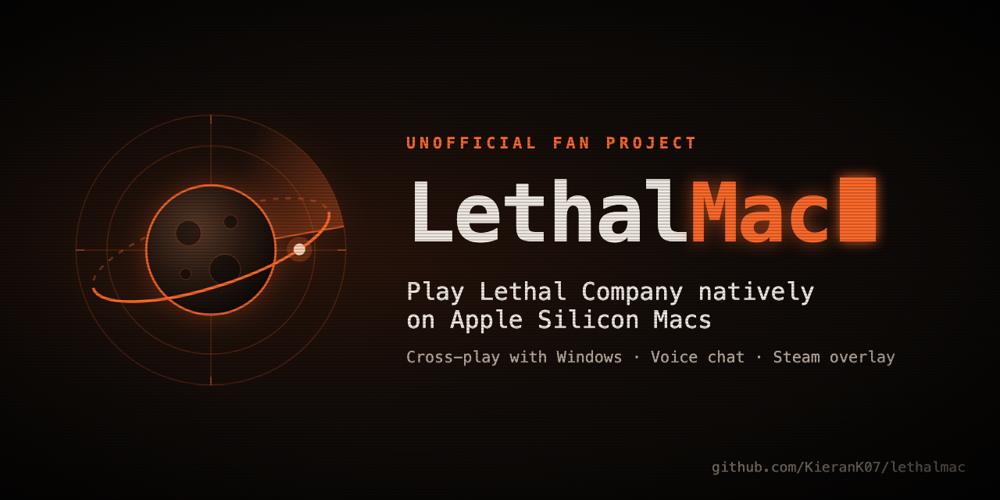

# LethalMac

> This is an AI-assisted project, built with a lot of help from Claude (Anthropic's AI). I've tested everything on my mac,
> but all the code is open source and right here if you want to look at any of it.

LethalMac turns your own Steam copy of Lethal Company (the Windows version) into a native app for Apple Silicon Macs.
You can still play with your friends on Windows, since the Mac app talks to Steam as the real game.

This repo only has my own code in it. The game, Unity's Mac runtime and all the third-party stuff get downloaded on
your Mac from their official sources while it runs, and the shaders get translated on your Mac too. Nothing from the
game is ever shipped here.

This is an unofficial fan project. Zeekerss didn't make it and doesn't endorse or support it, so please don't send him
Mac bug reports. It's free and it only works with a copy you own on Steam, so please don't sell it or use it to share
the game. I'm not affiliated with Zeekerss, Unity, Valve or Discord.

## How to use it

1. You'll need:
   - an Apple Silicon Mac
   - Xcode Command Line Tools (`xcode-select --install`)
   - Rosetta (`softwareupdate --install-rosetta --agree-to-license`), which Valve's SteamCMD needs (it only checks Steam for game updates, it never logs in as you)
   - Lethal Company on your Steam account, with Steam open and signed in
   - about 6 GB of free space
2. Double-click `LethalMac.command`. The first time, macOS might say it can't be opened. If it does, go to System Settings → Privacy & Security, scroll down and click Open Anyway.
3. Type `yes` to accept Unity's terms. Then it opens Steam's console and puts a command on your clipboard, paste it in there and press Return. That's Steam itself downloading your copy of the game (about 570 MB), so LethalMac never sees your password.
4. Wait. The first run takes about 30 to 40 min, mostly translating shaders.
5. Hit Play on Lethal Company in your Steam library. To set that up it closes Steam for a sec, marks the game as installed and points its launch option at the Mac app. Playtime, friends seeing what you're playing, invites and the Steam overlay (Shift+Tab) all work like the real game. Steam might show a "32-bit" warning, it's harmless.

## Updating

When Lethal Company updates, your Windows friends get it automatically, and you need it too if you want to keep playing
with them. Just double-click `LethalMac.command` again.

- It gets the new version the same way, one paste into Steam's console.
- If the game and the converter haven't changed, it says "up to date" and stops (under a minute).
- Otherwise it rebuilds, which takes about 10 min. The new app gets built next to the old one and swapped in at the end, so if an update fails your old app still works.
- Your saves and settings live outside the app, so you won't lose them.
- If Steam's Play button ever turns back into "Stream" (Steam refreshes its game info now and then), double-click `LethalMac.command` again. It fixes it in under a minute.
- If an update moves the game to a newer Unity version, the converter stops and tells you instead of building something broken. You'll need a newer version of LethalMac when that happens.

Already have the Windows files (like copied over from a PC)? Run `./convert.sh --game "/path/to/Lethal Company"`.
Rather have it download with Valve's SteamCMD and your login? Run `./convert.sh --steam-user <your Steam login>`.

## What it actually does

| Step | Where it comes from |
|---|---|
| Your game's Windows files | the Steam app you're signed into (its `download_depot` command) |
| Mac player, engine and Mono libraries | Unity's official 2022.3.62f2 installers (checksummed) |
| Shaders: Direct3D → Metal | translated on your Mac with Unity's open-source [HLSLcc](https://github.com/Unity-Technologies/HLSLcc) |
| Controller support | Unity's Input System 1.14.0 package, compiled for macOS |
| Steam, voice chat | my own native code, built on your Mac |
| Discord | Discord Game SDK 3.2.1 (official download) |

The cache lives in `~/Library/Caches/lethal-mac-converter`. It's safe to delete, the next run just downloads everything
again.

More details: [docs/APP-LAYOUT.md](docs/APP-LAYOUT.md) (where every file comes from) and [docs/LEGAL-NOTES.md](docs/LEGAL-NOTES.md).
